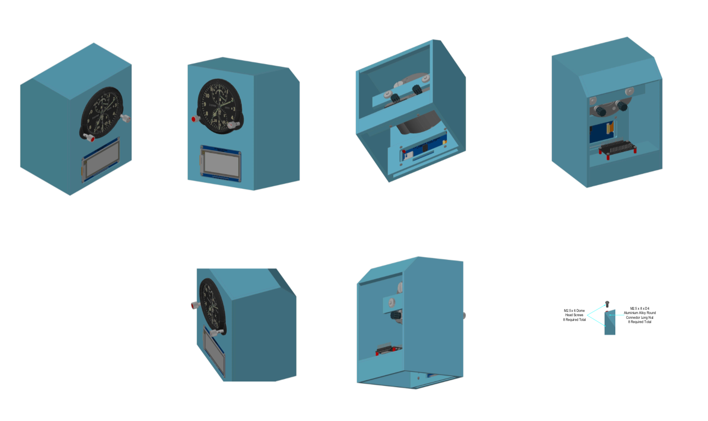

# MiG ACS-1 WeatherDisplay

The Russian ACS-1 aircraft clock is just sexy. It was made for numerous Soviet fighter jets such as the MiG-23, MiG-25, MiG-27 and the Su-27. 

Having been given one as a present from friends in Russia, I wanted to design both a housing for it and add a modern weather station utilising the ESP32 dev board and the new Adafruit 2.9" Diagonal E-Ink display. 

The housing was designed in AutoCAD and makes use of clear perspect to show off the internals of both the clock and the ESP32 and wiring

## TODO

There is still a huge amount to be done, mostly on how the data is displayed. My thoughts are:

- Add individual boxes around key elements such as temperature and wind speed
- Add images such as clouds or the sun to display according to the actual forecast
- Make better use of the try-colour display
